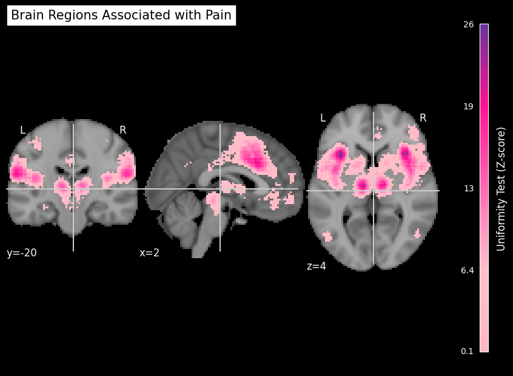

# Brain Regions associated with Pain: fMRI Data Visualization Project
- **Student Name:** Sude Özkara  
- **Date Completed:** 14-12-2024
- **Data Visualized:** [Neurosynth Pain Data](https://neurosynth.org/analyses/terms/pain/)

## About the Project
This project created for "Programming for Psychologists" course in Vrije University Amsterdam which visualizes brain regions associated with the term “pain” using publicly available functional MRI data from Neurosynth. It overlays functional data on anatomical brain scans, highlighting statistically significant areas. Additionally, the project generates a histogram to analyze the distribution of positive voxel values in the functional MRI data.

## Table of Contents
1. [Python Libraries Used](#python-libraries-used)
2. [Getting Started](#getting-started)
3. [Data Used](#data-used)
4. [Visualizations](#visualizations)

## Python Libraries Used
- **Nibabel**: For working with `'.nii'` files.
- **Nilearn**: For visualizing brain scans.
- **Matplotlib**: For creating plots.
- **NumPy**: For numerical operations.
- **os**: For file operations.
- **glob**: For finding files.

## Getting Started
1. Download the required anatomical and functional `'.nii'` files.

2. Set up a Python environment and install the necessary libraries.\
`pip install -r requirements.txt`

3. Run the code cells in Jupyter Notebook `'src/project.ipynb'` to generate the visualizations.

## Data Used
The project uses two types of files downloaded from [Neurosynth](https://neurosynth.org/analyses/terms/pain/) which can be found at `data` folder. 

- **Anatomical MRI Data**: High-resolution brain anatomy which can be found at `'data/anatomical.nii'`
- **Functional MRI Data**: Statistical overlays showing brain regions associated with the term "pain" which can be found at `'data/pain_uniformity-test_z_FDR_0.01.nii'`

## Visualizations
### 1. Brain Map
A functional overlay on anatomical brain scans highlighting regions associated with the term "pain."

### 2. Histogram
A distribution of positive voxel values in the functional MRI data.

Screenshots are retrieved from `'images'` folder.

